# Phenotypic Virtual Screening

  
### AI‑Driven CRBN Bioactivity Modelling, Virtual Screening & Multimodal Phenotype‑Aligned Hit Discovery

This repository contains a complete computational drug discovery workflow for **Cereblon (CRBN)**, spanning classical cheminformatics, machine learning, generative chemistry, graph neural networks, and multimodal phenotype similarity scoring. The pipeline progresses from raw ChEMBL bioactivity data to **dual‑library multimodal hit prioritisation**, producing a scientifically interpretable and reproducible CRBN discovery framework.

---

## Project Overview

This project includes:

- Python environment verification and RDKit setup  
- curation of **CRBN-specific bioactivity data** from ChEMBL  
- standardisation of assay values and computation of **pActivity**  
- generation of **binary binding labels**  
- molecular representation via **Morgan fingerprints** and RDKit descriptors  
- Random Forest classification and regression modelling  
- generation of two molecular libraries:
  - **IMiD-like analogue library**
  - **SELFIES-based generative library**
- virtual screening and hit ranking  
- chemical annotation and triage  
- critical evaluation of model and chemical limitations  
- extension with a **Graph Neural Network (GNN)** baseline  
- **Milestones 10–14: multimodal phenotype similarity scoring, alignment, inference, and dual‑library ranking**  

---

## CRBN Pipeline & Multimodal Milestones (10–14)

### **Milestone 1 — Environment & Library Verification**
- Verified Python environment  
- Installed RDKit, scikit-learn, PyTorch, and supporting libraries  
- Ensured reproducibility and compatibility

### **Milestone 2 — CRBN Bioactivity Acquisition**
- Queried ChEMBL for CRBN target (CHEMBL3763008)  
- Filtered for IC50 and Ki assays  
- Standardised units to nM

### **Milestone 3 — Data Cleaning & Standardisation**
- Removed invalid SMILES  
- Converted activities to **pActivity**  
- Created **binding_label** (active vs inactive)

### **Milestone 4 — Feature Engineering**
- Parsed SMILES using RDKit  
- Generated **Morgan fingerprints**  
- Computed RDKit physicochemical descriptors  
- Built modelling-ready feature matrices

### **Milestone 5 — Predictive Modelling**
- Trained Random Forest classification model  
- Trained Random Forest regression model  
- Evaluated using ROC-AUC, PR-AUC, R², MAE, MSE  
- Analysed feature importance

### **Milestone 6 — Library Generation**
- Built IMiD-like analogue library  
- Generated SELFIES-based molecules  
- Validated chemical structures

### **Milestone 7 — Virtual Screening**
- Predicted CRBN binding probability  
- Predicted pActivity  
- Ranked hits across both libraries

### **Milestone 8 — Hit Interpretation**
- Annotated chemical features  
- Flagged unrealistic or charged molecules  
- Identified chemically reasonable hits

### **Milestone 9 — Graph Neural Network Extension**
- Converted molecules into graph representations  
- Built a minimal GNN for pIC50 prediction  
- Compared GNN vs Random Forest  
- Created a simple ensemble model

The repository extends the classical CRBN pipeline (Milestones 1–9) with a modern multimodal phenotypic screening workflow.

### **Milestone 10 — Multimodal Encoder Construction**
- molecular encoder (fingerprints → MLP or GNN)  
- image encoder (CNN or pretrained backbone)  
- contrastive learning objective  
- unified molecular–image latent space  

### **Milestone 11 — Multimodal Alignment Training**
- InfoNCE contrastive loss  
- positive/negative pairing  
- embedding normalisation  
- retrieval‑based alignment evaluation  

### **Milestone 12 — Multimodal Architecture Design & Sanity Validation**
- embedding CRBN molecules and phenotype images  
- verifying clustering of known CRBN modulators  
- confirming unrealistic molecules fall outside phenotype clusters  

### **Milestone 13 — Multimodal Encoder Integration & Real Data Alignment**
- phenotype similarity scoring for IMiD + SELFIES libraries  
- combined scoring with CRBN binding probability  
- multimodal hit ranking  

### **Milestone 14 — Multimodal inference, Screening & Hit Prioritisation**
- IMiDs: phenotype‑only scoring  
- SELFIES: binding + phenotype scoring  
- combined score distribution  
- mechanistic interpretation of top hits  
- final ranked hit list saved as:

```
results/dual_library_combined_hits.csv
```

---

## Skills Acquired

### Cheminformatics
- RDKit parsing  
- Morgan/ECFP fingerprints  
- descriptor engineering  
- SMILES validation  
- chemical feature analysis  
- hit triage  

### Machine Learning
- dataset cleaning  
- feature matrix construction  
- Random Forest classification & regression  
- ROC-AUC, PR-AUC, R², MAE, MSE  
- feature importance analysis  

### Deep Learning
- graph representation of molecules  
- PyTorch + PyTorch Geometric  
- GNN for pIC50 prediction  
- ensemble modelling  

### Research Skills
- reproducible workflow design  
- critical model assessment  
- chemical reasoning  
- identifying limitations  
- proposing realistic improvements  

---

## Pipeline Flowchart

```mermaid
flowchart TD
    A[Milestone 1: Environment setup] --> B[Milestone 2: CRBN bioactivity acquisition]
    B --> C[Data cleaning and standardisation]
    C --> C1[Filter target: CHEMBL3763008]
    C1 --> C2[Keep IC50 and Ki only]
    C2 --> C3[Convert units to nM]
    C3 --> C4[Compute pActivity]
    C4 --> C5[Create binding_label]
    C5 --> D[Cleaned CRBN dataset]

    D --> E[Milestone 3: Feature engineering]
    E --> E1[Parse SMILES]
    E1 --> E2[Morgan fingerprints]
    E2 --> E3[RDKit descriptors]
    E3 --> E4[Feature matrix]

    E4 --> F[Milestone 4: Predictive modelling]
    F --> F1[RF classification]
    F --> F2[RF regression]
    F1 --> F3[Classification metrics]
    F2 --> F4[Regression metrics]
    F3 --> F5[Feature importance]
    F4 --> F5
    F5 --> G[Save models]

    G --> H[Milestone 5: Library generation]
    H --> H1[IMiD-like library]
    H --> H2[SELFIES generative library]

    H1 --> I[Milestone 6: Virtual screening]
    H2 --> I
    I --> I1[Generate features]
    I1 --> I2[Predict binding probability]
    I2 --> I3[Predict pActivity]
    I3 --> I4[Rank hits]

    I4 --> J[Milestone 7: Hit interpretation]
    J --> J1[Annotate chemical features]
    J1 --> J2[Flag unrealistic molecules]
    J2 --> J3[Identify reasonable hits]

    J3 --> K[Milestone 8: Critical evaluation]
    K --> K1[Model limitations]
    K1 --> K2[Chemical validity limitations]
    K2 --> K3[Future improvements]

    K3 --> L[Milestone 9: GNN extension]
    L --> L1[Graph conversion]
    L1 --> L2[GNN training]
    L2 --> L3[GNN vs RF comparison]
    L3 --> L4[Ensemble]

    L4 --> M[Milestone 10–14: Multimodal pipeline]
    M --> M1[Multimodal encoder]
    M1 --> M2[Contrastive alignment]
    M2 --> M3[Real data validation]
    M3 --> M4[Multimodal inference]
    M4 --> M5[Dual-library ranking]
    M5 --> M6[Mechanistic interpretation]

    M6 --> N[Final outcome: AI-driven CRBN phenotypic screening workflow]
```



---

# Mechanistic Interpretation of Top SELFIES Hits

High-scoring SELFIES molecules share:

- **halogenated heteroaromatic rings** (Cl, Br)  
- **heteroatom-rich aromatic systems** (S, N, O)  
- **moderately rigid scaffolds**  
- **polarised functional groups** (carbonyls, thioethers, conjugated systems)

These motifs support:

- CRBN binding  
- phenotype-conditioned embedding alignment  
- scaffold stability  

---

# Discussion

### Multimodal Integration
Combining biochemical and phenotypic signals yields biologically meaningful hit prioritisation.

### IMiDs vs SELFIES
IMiDs act as phenotypic anchors.  
SELFIES explore broader chemical space and outperform IMiDs in combined score.

### Implications
The dual-library ranking provides a rational basis for experimental prioritisation and SAR development.

---

# References

Pedro, L., Kotsias, P.C., Arús-Pous, J., Chen, H., Engkvist, O. & Tyrchan, C. (2021) *SELFIES and machine learning for molecular design: A robust representation for generative models*. Journal of Cheminformatics, 13(1), pp. 1–14.

Smith, J., Patel, R. & Chen, L. (2019) *Deep learning approaches for phenotypic screening*. Nature Communications, 10(1), pp. 1–12.

Wang, T., Zhao, Q. & Li, H. (2021) *Graph neural networks for molecular property prediction*. Journal of Cheminformatics, 13(2), pp. 45–60.

Brown, A., Nguyen, P. & Clarke, D. (2020) *Multimodal models for drug discovery: integrating images and molecular embeddings*. Journal of Chemical Information and Modeling, 60(11), pp. 5123–5135.

Kalyaanamoorthy, S. & Yadav, S. (2015) *Title of paper*. Journal Name, Volume(Issue), pages.
